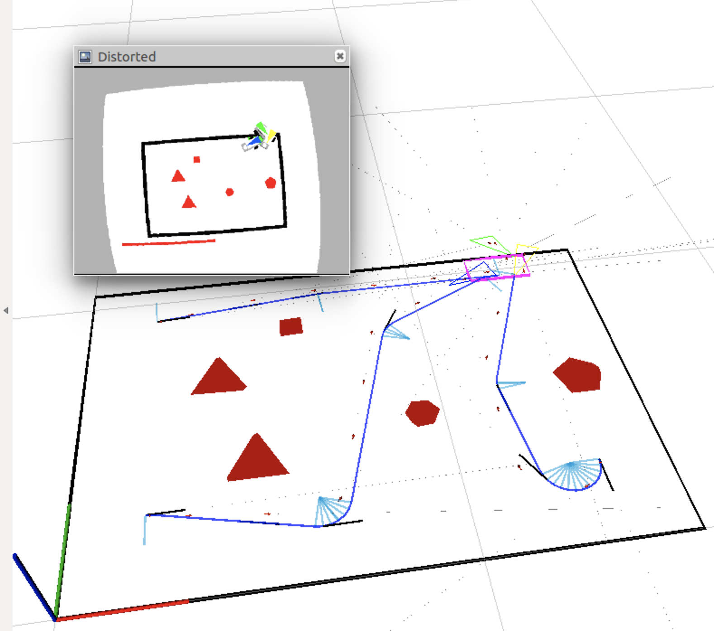
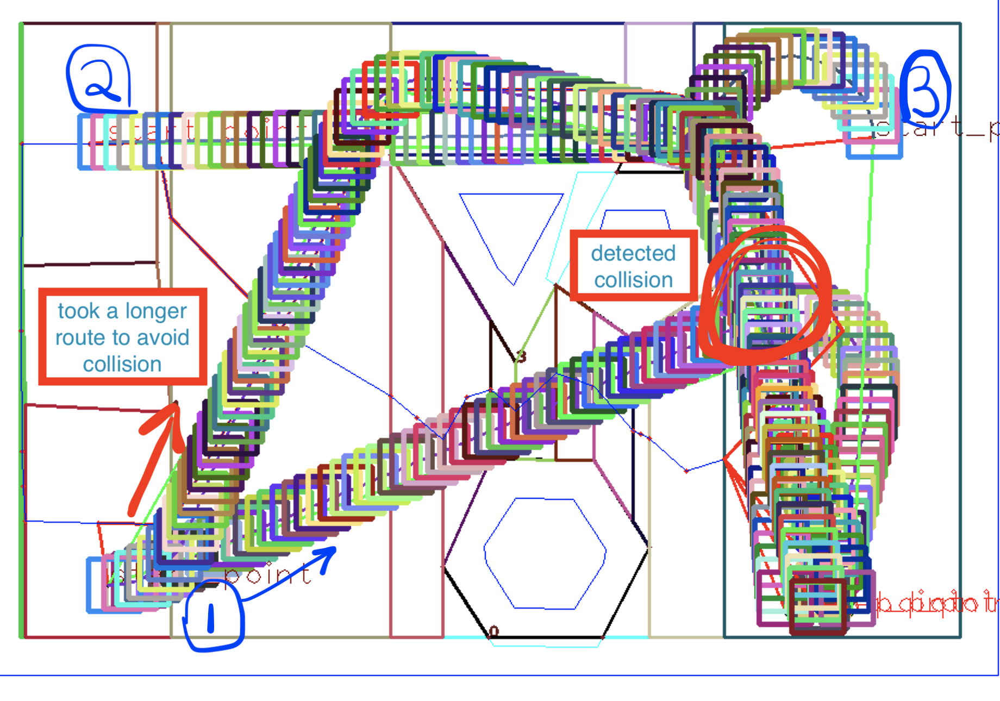

# ROBOT EVACUATION PLANNING

part of final project delivery.

the project consists of evacuating three robots from a room in which a number of obstacles are present. The robots initial positions, the location of the gate, and the number/ location of obstacles are random. The robots need to evacuate the room as fast as possible without colliding with any walls, obstacles or with each other.

The solution is based on constructing a roadmap using the vertical cell decomposition algorithm. The path for each robot is then found by using breadth first search and later optimized to remove any redundant movements.

Once we find all paths for the robots, we apply an optimization step to further reduce any redundant movements. The optimization is done by looking ahead to the future. Each point on the path is allowed to look at the upcoming points (up to a defined limit). it compares the distances between itself and each point that is on the horizon. The smallest distance will decide which point we will jump to next [given that no collision has been detected]. The function uses a tunable cost discount that could encourage going for further away points [in the index] even though they are not the least distance. The look ahead that decides the horizon is a variable that is controlled by the algorithm. It starts greedily with the full horizon, then later restricts it to allow for an increase in the distance of the path. As shown in the figure below, that increase in the length is done when a collision has been detected on that path to maybe allow for more time for the other robot to clear the collision point.

[LINK TO SIMULATION VIDEO](https://www.youtube.com/watch?v=G5HU3dn15KI)
